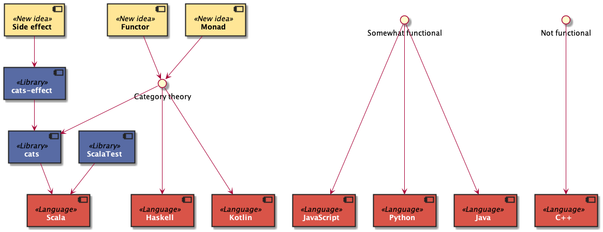
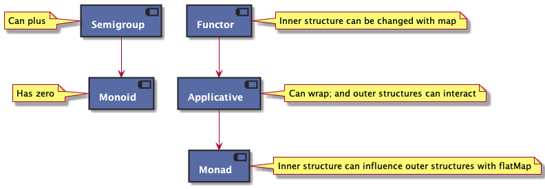

## From Kittens<br>To Cats 😸

The theory behind `cats`

---

# Functor

----

# Monad

----

# Monoid

----

# Category theory

----

# Cats 😸

---

# Visual tour

----


----


Scala is a multi-paradigm language.

----


`cats` is a library

----


`cats-effect` is another library

----


`cats` reinforces **functional programming** design patterns

----

## 📚 Not covered

FP stuff:

- **referential transparency**
  - **immutability**
  - **side-effect** management

----


`cats` introduces new concepts to Scala

----


Category theory is not unique to Scala

----



Not every language can support these new ideas

---

# Math review

----

## Natural numbers
# `1 + 2 = 3`

----

## Natural numbers
- Given a `natural number`
- And given another `natural number`
- And the `addition` operation
- We can get another `natural number`

----

## Rational numbers
## `1.2 + 8.3 = 9.5`

----

## Rational numbers
- Given a `rational number`
- And given another `rational number`
- And the `addition` operation
- We can get another `rational number`

----

## Strings

```
"foo" + "bar" == "foobar"
```

----

## Strings
- Given a `String`
- And given another `String`
- And the `concatenate` operation
- We can get another `String`

----

### Natural numbers, rational numbers, and `String`s are **structured similarly**

----

### 🤔 Can the **common structure** be factored out?

----

### **Category theory** is the study of similarly structured things.

Where things include numbers.

----

### `cats` is the application of **cat**egory theory to types in Scala

----

### `cats` provides a **consistent interface** to different types in Scala **if** they are structured similarly

Interface as in "coding experience", not literally a Java `interface`

---

## The structure

----

### Built-in types

```scala
// Int
1 + 2 == 3

// String
"foo" + "bar" == "foobar"
```

----

### 🤔 What about a new type?

```scala
case class Frac(numerator: Int, denominator: Int)

// built-in + not defined for Frac
Frac(1, 2) + Frac(3, 4) == Frac(7, 8)
```

## 💥

----

### `+` could be a normal method off of `Frac`...

```scala
case class Frac(numerator: Int, denominator: Int) {
  def `+`(that: Frac): Frac =
    ???
}
```

----

### But what about structural sharing with `Int` and `String`?


----


We introduce a **new abstraction** that describes the structure of the original types.

----

```scala
1 |+| 2 == 3

"foo" |+| "bar" == "foobar"

Frac(1, 2) |+| Frac(3, 4) == Frac(7, 8)
```

`CanPlus[_]` also provides a `|+|` operator to all types that support this structure...

...regardless of the type's owner.
<!-- .element: class="fragment" -->

----

### `CanPlus[_]` is an example of a **type class**

...a compiler-supported feature in Scala/Haskell used to describe the structure of other types
<!-- .element: class="fragment" -->

...analagous to the way `abstract class`es or `trait`s describe structure for first-party, object-oriented types
<!-- .element: class="fragment" -->


----

- `CanPlus[Int]` describes that `Int` can plus...
- `CanPlus[String]` describes that `String` can plus...
- `CanPlus[Frac]` describes that `Frac` can plus...

----

- Also called providing "proof" or "evidence" to the compiler with a **type class instance**
- Analogous to implementing an `abstract` `class`/`trait`

----

## `cats` provides...

- Common **type classes**
- Evidence for those type classes, for built-in Scala types
- The opportunity to provide evidence for first or third-party types

----

## 📚 Not covered

- `cats` syntax
- `implicit` injection

---

# Type classes

----

### `Functor`, `Monad`, `Monoid` are all examples of **type classes** provided by `cats`

----

### Yes, the names are terrible 😭

----

## Five most common

Split into two groups

----

### Group 1️⃣

## **Big data** type classes


----


Type classes can also inherit from others

e.g. every `Monoid` is a `Semigroup`

----

### `CanPlus[_]` is actually `Semigroup[_]`

Describes the ability to `|+|` within a type

```scala
1 |+| 2 == 3

"foo" |+| "bar" == "foobar"

Frac(1, 2) |+| Frac(3, 4) == Frac(7, 8)
```

----

`Monoid[_]` describes a **zero** or **empty** value

```scala
x |+| Monoid[Int].empty == x // 0

"foo" |+| Monoid[String].empty == x // ""

Frac(1, 2) |+| Monoid[Frac].empty == x // Frac(0, 1)
```
----


---

# Scala review

----

## Mapping

```scala
List(1, 2, 3).map(_ + 1)
List("ren", "stimpy").map(_.length)
```

----

## More mapping

```scala
Option(3).map(_ + 1)
Try("ren").map(_.length)
```

----

## Various structures "can `map`"

----

## They are all "containers"

with an "inside" and an "outside"

----

| Type        | Description     |
|-------------|-----------------|
| `List[A]`   | Length, multitude |
| `Option[A]` | Optionality     |
| `Try[A]`    | Success |

----

### Mapping **cannot** influence the container

```scala
// Some => Some
// or None => None
optionInt.map(_ + 1)

// strings.length == strings(_ + " phd").length
strings(_ + " phd")
```

Highly targeted **separation of concerns**
<!-- .element: class="fragment" -->

----

### Also true for every kind of `List[_]`

```scala
// Some => Some
// or None => None

optionInt.map(_ + 1)
optionDouble.map(_ + 3.0)
optionString.map(_ + " phd")
```

----

- `CanMap[List]` describes that every `List[_]` can `map`
- `CanMap[Option]` describes that every `Option[_]` can `map`

----

### `CanMap[_]` is actually `Functor[_]`

----

## 📚 Not covered

**Laws**: other structural properties types need to obey

❌ `Set` and `Future` are not "lawful" functors despite having `map`
<!-- .element: class="fragment" -->

----

| Type           | Description |
|----------------| --- |
| `IO[A]`        | Side-effect |
| `Either[E, A]` | Error capture |
| `B => A`       | Dependency on `B` |
| `JsonDecoder[A]`  | Ability to produce `A` |

## 🤔

----

## A `functor` isn't always a "container"

----

# `F[A]`

A "strategy" `F` for producing/dealing with values of `A`

----

```scala
type F[A] = Either[E, A]
type G[A] = B => A
```

---

# Baking 🍰

----

1. Start with dry ingredients
2. Mix in wet ingredients
3. Put into a pan
4. Bake!

----

- Start with dry ingredients
  - Mix in wet ingredients
    - Put into a pan
      - Bake!

----

## Step N **depends on** step N - 1

----

```scala
val xy = 
  for {
    x <- List("a", "b", "c", "d")
    y <- List(1, 2)
  } yield (x, y)
```

Length (or structure) of `xy` depends on each step

`4 * 2 == 8`

----

```scala
val xy = 
  for {
    x <- List("a", "b", "c", "d")
    y <- List(1, 2)
  } yield (x, y)
```

```scala
def y(x: String) =
  List(1, 2).map(y => (x, y))

val xy =
  List("a", "b", "c", "d")
    .flatMap(y)
```

----

A `for-comprehension` is a "synonym" for `flatMap`

Aka **syntactic sugar** (not exclusive to `cats` or Scala)

----

```scala
val xyz =
  for {
    x <- optionX // what if None?
    y <- optionY
    z <- optionZ
  } yield (x, y, z)
```

Optionality (or structure) of `xyz` depends on each step

Can also "fail fast"

----

```scala
def posBanner(n: Int): Option[String] =
  if (n > 0)
    Some("yay")
  else
    None

val banner =
  for {
    n <- optionN
    pos <- posBanner(n) // <-- spicy examination
  } yield pos
```

Examination of `n` can influence the optionality (or structure) of `somePos`

----

### `def posBanner`
### `(n: Int) => Option[String]`

----

#### `(n: Int) => Option[String]`
## `A => F[B]`

----

## `A => F[B]`

```scala
def flatMap(f: A => F[B]): F[B]
```

The structure `F[B]` depends on `A`

But also cannot "see" the previous `F`
<!-- .element: class="fragment" -->

----

## `Monad[F]`
#### `CanFlatMap[F]`

- Any strategy `F` that can be ordered or **sequenced** with itself
  - A "monadic" workflow
- Also a `functor`

----


----

### 📗 `for-comprehension`s only work with monads of the **same type**

----

### 🤔 Applicative

- Hardest to build an intuition for
- Two capabilities

----

### 1️⃣ It can wrap
## `A => F[A]`
#### `CanWrap[_]`

Also called **pure**

----

### 2️⃣ Sequencing...?

```scala
(fa: F[A], fb: F[B]) => F[(A, B)]
```

----

```scala
(fa: F[A], fb: F[B]) => F[(A, B)]
```

- The outsides can interact (new ✨)
- The insides can interact (from `map`)
- But the inside cannot affect the outside (unlike `flatMap`)

----



---

## Why `cats`? 😺

----

### 🤷🏽 "As long as it's a `Monad`..."

----

- Highly consistent
- Can use `for-comprehension`
- Can use `map`
- Highly composable, like "legos"
- Leverages previous experience

----

| Type             | Description |
|------------------| --- |
| `IO[A]`          | Side-effect |
| `Either[E, A]`   | Error capture |
| `B => A`         | Dependency on `B` |
| `JsonDecoder[A]` | Ability to produce `A` |

----

## Why `Functor`?

- Every `Monad` is a `Functor`
- Can change the inner structure without changing the outer structure
  - Can change the "presentation" (`A => B`) of a value without changing the "strategy"

----

## Why `Monad`?

- Can consistently model dependent steps
- Can more easily communicate error workflow
  - "Fail fast" or "first one wins"

----

## 📚 Not covered

- `cats-effect`
  - hint: `IO[A]`
- **monad transformers**
  - two monads combined to make one monad

---

## But wait

----

### 🤬 "You don't need `cats` to call `map` on `List`"

----

## You're right ✅

----

## 😸 `cats` provides:

- Consistent interfaces to types beyond Scala's built-in types
- Stronger, "more correct" design choices where Scala falls short

---

## I'm a `cats` person 🐈

----

## `cats` "platform"

----


---

# Recap

----

`cats` 😸 is a Scala library that reinforces **functional programming** design patterns by providing **consistent interfaces** to types that share similar properties

----

- It provides **type classes** and **evidence** for them, for built-in Scala types
- Common type classes in **big data** are `Semigroup` and `Monoid`
- The most common everywhere are `Functor`, `Applicative`, and `Monad`
